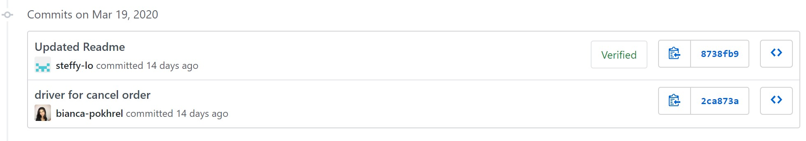
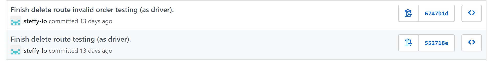
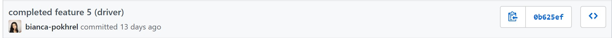
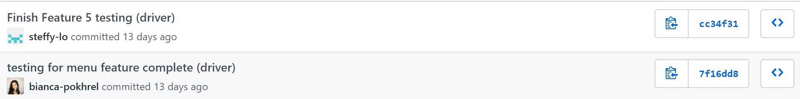

# A2 - Pizza Parlour API

## User Instructions:  
 - Run the main Flask module by running `python3 PizzaParlour.py`

 - Run unit tests with coverage by running: 
`pytest --cov-report term --cov=. tests/unit_tests.py`

- To place a new order, simply send a `POST` request to the following route `/new_order` with the JSON in the following format:

`{
         "pizzas": [{"size": "small",             "type":"pepperoni", "toppings": ["olives", "tomatoes"]}],
         "drinks": ["coke", "pepsi"]
     }`

Where `'pizzas'` is a list with one or more pizzas and `'drinks'` is a list with one or more drinks.

- To update an existing order, send a `PATCH` request to the following route `/update_order/<int: orderID>` with the following JSON format:

`
     {
         "pizzas": [{"itemID": <str>, "size": "small", "type": "pepperoni", "add_toppings": ["mushrooms", "beef"], "del_toppings": []}],
         "drinks": {"add": ["water"], "remove": ["coke", "pepsi"]}
     }`

Where each part of the order has an add/delete key to update the existing order.

- To cancel an existing order, send a `DEL` request to the following route: `/cancel_order/<int: orderID>` where orderID is the id of an existing order.

- To add the 'in store pickup' option to an order, send a `POST` request to the following route: `/pickup_order/<int: orderID>` where orderID is the id of an existing order. Note that this must be called **after** creating a new order.

- To add the 'in house delivery' option to an order, send a `POST` request to the following route: `/deliver_in_house` with the following JSON format:

`{"orderID": xxx, "address": xxx}`

Where orderID is the id of an existing order and address is a valid address. Note that this must be called **after** creating a new order.

- To request a delivery via Uber/Foodora, send a `GET` request to the following route: 
    - Uber: `\delivery_uber`
    - Foodora: `\delivery_foodora`

With the following JSON format for both:

`{
            'order_details': (order data), 
            'address': "123 John Lane",
            'order_number': "UBER10001"
        }`

Where order data is a dictionary that is formatted exactly like the JSON required to place a new order

- To display the full menu, simply send a `GET` request to the following route: `/display_menu`

- To display a specific menu item, send a `GET` request to the following route: `/display_menu_item`. You can request to see a specific pizza or drink. Here are a few examples of accepted JSON requests:
    - `{"pizza": {"size": "small"}} `
    - `{"pizza": {"size": "small", "type": "veggie", "toppings": ["mushroom"], "drink": "coke"}}`
    - `{"drink": "pepsi"}`

## Pair Programming

In total, we used pair programming for two main features in our program. Cancelling orders as well as asking for the menu. We decided on these features because the overall implementation of these features was not extremely complex and nuanced. Therefore we found it to be easier to pair program over video call given the constraints of meeting in person 

### Feature 1: Cancel Order
#### Main Functionality
**Driver:** Bianca 

 **Navigator:** Steffy

Implementing this feature was very straightforward and we were able to do it easily over video call. We both agreed with each other's comments and we didn't run into any conflicts regarding the design of the feature.

#### Testing
**Driver:** Steffy

 **Navigator:** Bianca
It went pretty smoothly. Through testing we ended up making another design decision regarding the error messages we should give for invalid input. Ultimately, we decided to go with a more simplistic approach and we wrote our tests to reflect that (added additional test cases instead). This can also be seen in the additional commit Steffy made when we were writing the tests for the features. We liked how the test methods were immediately working as expected. We just had to make sure a thorough test coverage.

### Feature 2: Asking for Menu
#### Main Functionality
**Driver:** Bianca 

 **Navigator:** Steffy 

It went quite well. We spent a fair amount of time discussing how to structure the data for displaying the menu. Once we agreed on the best approach, it was smooth sailing with Steffy as the navigator catching any small errors while Bianca acted as the driver. Overall, there was no conflict regarding the design and implementation of this feature. Comments and suggestions were 

#### Testing (done in two parts)
**Driver**: 
 - Bianca _(Part One)_
 - Steffy _(Part Two)_ 
 
 **Navigator**: 
 - Steffy _(Part One)_ 
 - Bianca _(Part Two)_

Overall writing the tests for the menu feature was long and tedious as there were many test cases to cover. At this point we both decided to split up the pair programming tasks for this feature. This decision is also reflected in our commit history. There was a small problem we had with floating point numbers with Python but that got quickly resolved once we changed the numbers we used during assertion. There were also other small problems we encountered with getting our methods to pass our tests but soon enough we realized that it was mostly minor errors such as spelling and invalid mock data in our test methods that were causing the tests to fail.

## Program Design

### Design Pattern

The design pattern we chose to build this API is the builder pattern. We chose this pattern (over the factory method) mainly because a pizza is an object that essentially involves the same steps to make, differing only in the details (i.e., the toppings). This effectively eliminates the telescopic constructor problem by collecting the many arguments one at a time, and keeps the code much cleaner/maintainable. In addition, we add a class called the Pizza Factory which handles the creation of these pizza along with the support of adding new types of pizzas and toppings. Lastly, we decided to store our pizza and drinks information in json files which creates flexibility of offering more options for both pizzas and drinks.

### Code Cohesion

In our API, the only objects are pizzas and therefore, there are technically no coupling between any objects and this follows into code cohesion.

### Function Design

In our pizza class, we have implemented dependency injection when calculating the price of a pizza, injecting an instance of a pizza factory. This is done as the price of a pizza will depend on given base prices of sizes, type, and topping prices which is determined through the pizza factory. This effectively increases code cohesion.

## Code Craftmanship

Steffy: Solely used PyCharm IDE to help with programming and formatting style

Bianca: Used python linting in VScode to help with programming and formatting style. At times also referred to Sourcemaking's "Code Smells" page.
